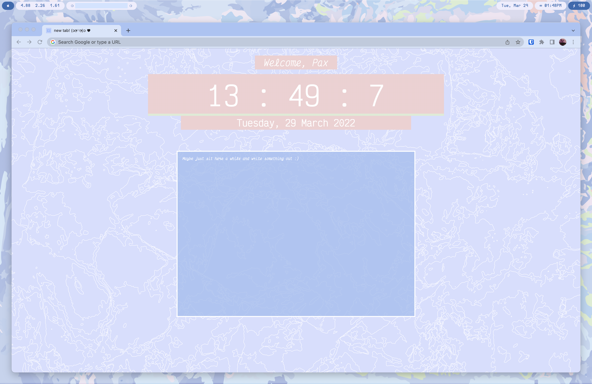

# Pax's Chrome 'New Tab' Replacement
Simple but cute New Tab Replacement!

## Current Feature Plan
1. Visual Improvements
	1. Matches Pax's custom color scheme
	2. Not ugly
	3. No ads or Google Doodle
	(not all of them are ugly, but none of them fit my theme)
2. Clock
3. Basic WYSIWYG Notepad

## Future Features
4. Notes that can be stickied
5. Chrome uptime and other stats
6. Message box that reminds you of tabs you haven't clicked on in a while
7. 'Bored Button' to open a random saved article

 

### *How do I build one?*

I vaguely followed [this](https://executebig.notion.site/Building-a-New-Tab-page-d3cb4360ec90493c8c5aa0cb3570239e) tutorial for guidance as I had never built with Chrome's Extension API before. (Shoutout to [Execute Big](https://executebig.org/) for making cool resources and making them free! This one is from their project [Tech Roulette](https://techroulette.xyz/).)
I also vaguely referenced [this](https://hackernoon.com/building-a-new-tab-chrome-extension-with-zero-dependencies-5zlh3ue6) Hackernoon article by [Dane Lyons](https://hackernoon.com/u/Dane).
Chrome's [Extension Documentation](https://developer.chrome.com/docs/extensions/mv3/override/) for overriding the default newtab, bookmarks, and history pages are of course the bible here.
I used Figma to resize my art for the 16x16 and 128x128 icons required.
The ultimate resource for quickly checking your HTML and CSS is [W3Schools](https://www.w3schools.com/), IMO.

That being said, if you're looking for a quick fix and aren't big on writing your own extensions, you could make one with Google's own [no-code tool](https://tabmaker.withgoogle.com/).

### *How to set up this one?*

I decided to download Quill's package directly from [their website](https://quilljs.com/), which also contains pretty cool guides and a playground to modify the editor if you want. You can choose the CDN host or install it via npm, but you'll have to modify the files yourself.
